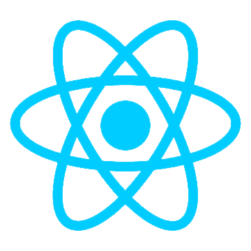
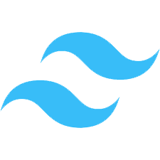

##  About Me

 
I'm a web development newbie, constantly refreshing my browser to see my code come to life (and sometimes pulling my hair out when it doesn't!). I'm passionate about creating beautiful and functional websites, and I'm always up for a challenge.

##  Links

## Tech Stack
<pre>
    
</pre>

## Contact

If you have any feedback, please reach out to us at work.ronitghosh@gmail.com

